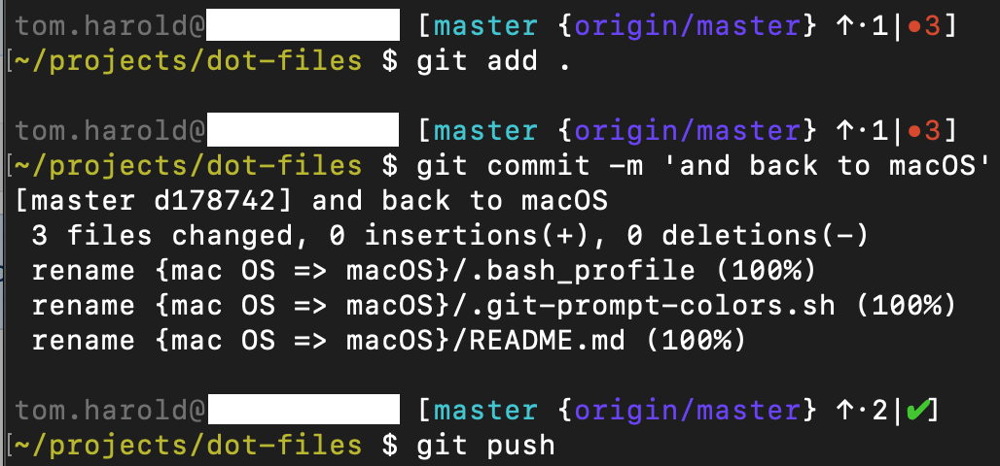

# macOS

## git bash prompt

Uses [bash-git-prompt](https://github.com/magicmonty/bash-git-prompt) from [homebrew](https://brew.sh/).

See [.bash_profile](.bash_profile) and [.git-prompt-colors.sh](.git-prompt-colors.sh) for how to set things up.

